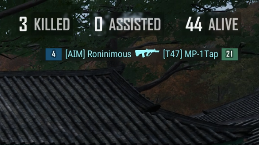
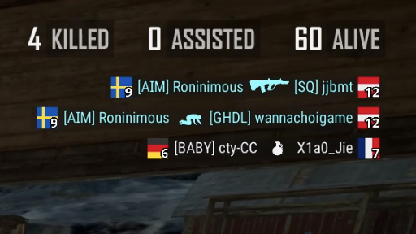
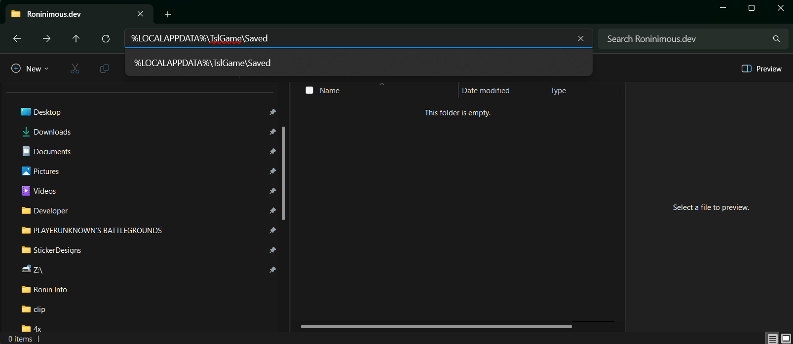

# 🎮 Customise Your PUBG Killfeed Icon with Flags!  
Transform your PUBG killfeed with custom flag icons and numbers for better visibility and tracking.

---

## 📖 About This Project  

By default, PUBG killfeed icons come with colors and numbers. While this is functional, some colors can be repetitive, making it harder to track kills effectively. To solve this, PUBG developers introduced a feature for tournaments to allow custom team logos in the killfeed.  

However, official references for implementing these custom icons were scarce, so I decided to create my own custom icons for easier identification. While exploring this idea, I discovered a fantastic repository on Reddit by [Ciseur](https://github.com/Ciseur/ciz-pubg-killfeed-flags), who had already implemented flag icons and numbers.  

For now, I'll use these flag icons until I finalise my custom designs. Flags offer an intuitive way to differentiate teams, making tracking kills much easier at a glance.  

---

### Before & After Preview  

**Default Killfeed Icons:**  
  

**Killfeed Icons with Flags and Numbers:**  
  

The flags are ordered consistently from team #1 to team #50 for clarity.

---

## 🚀 Features  

- **Enhanced Visibility**: Use flag icons for quicker killfeed recognition.
- **Consistent Ordering**: Flags are mapped from team #1 to #50.  
- **Customisable**: Easily replace the flag icons with your own designs (coming soon with custom logos!).  

---

## 📥 Installation Guide  

Follow these simple steps to customise your PUBG killfeed with flag icons:  

1. **Download the Files**  
   - Go to the [GitHub repository](https://github.com/roninimous/pubg-killfeed-icons/tree/main/Observer) and download the `Observer` folder.  

2. **Locate the Directory**  
   - Open Windows File Explorer and navigate to:  
     ```
     %LOCALAPPDATA%\TslGame\Saved
     ```
  
3. **Paste the Files**  
   - Paste the entire `Observer` folder you downloaded into the above directory.  

4. **Restart PUBG**  
   - Launch PUBG and enjoy your new killfeed icons!  

5. **Celebrate**  
   - Winner Winner Chicken Dinner! 🐔  

---

## 📌 Future Plans  

While flags make killfeeds easier to track, I believe custom-designed icons can enhance the experience even further. I plan to work on unique, easy-to-recognize icons in collaboration with a designer. Stay tuned for updates!  

---

## 🤝 Credits  

- **Flag Icons and Repository**: [Ciseur](https://github.com/Ciseur/ciz-pubg-killfeed-flags)  
- **Original Concept**: PUBG Developer Team  

---

## 📜 License  

This project is open source and follows the licensing terms of [Ciseur's repository](https://github.com/Ciseur/ciz-pubg-killfeed-flags).  

---

## 🌍 List of Flags with Team Numbers  


|||||
| -- | -- | -- | -- |
| Canada| Poland| Finland| Denmark|
| Brazil| Germany| France| United Kingdom|
| Sweden| Norway| Spain| Austria|
| Turkey| USA| Portugal| Argentina|
| Korea| Japan| Australia| China|
| Croatia| Greece| Ukraine| Italy|
| Europe| Switzerland| Saudi Arabia| South Africa|
| Morocco| Thailand| Israel| Jamaica|
| Cuba| Uruguay| Colombia| Congo|
| India| Kenya| Wales| Czechia|
| Scotland| Kazakhstan| Ireland| Algeria|
| Romania| Angola| Bahamas| Greenland|
| Olympics| Pirate|


